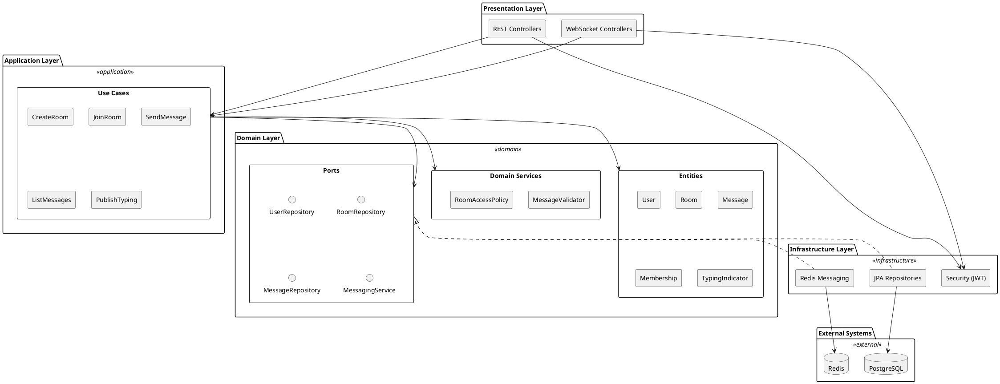
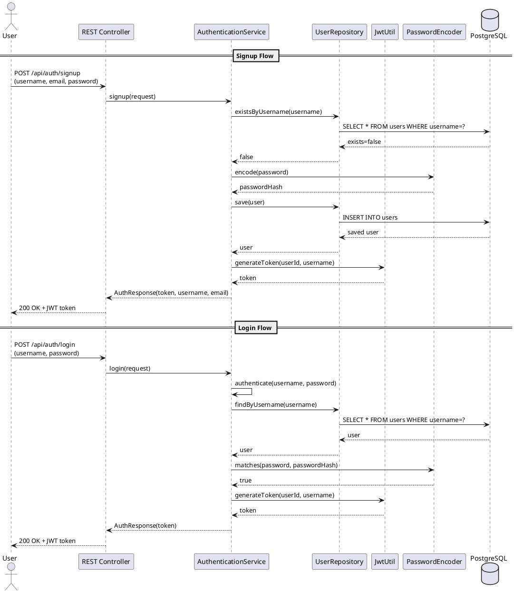
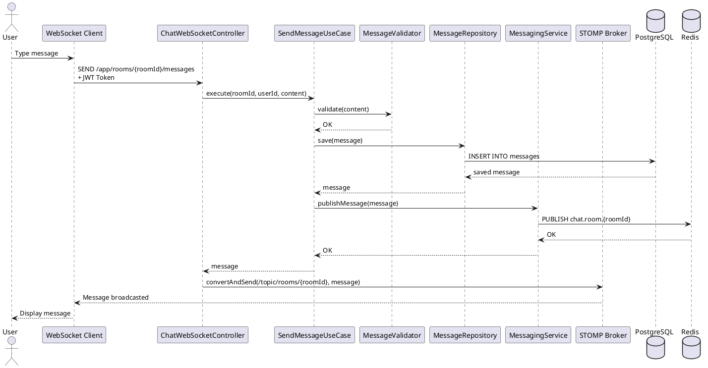
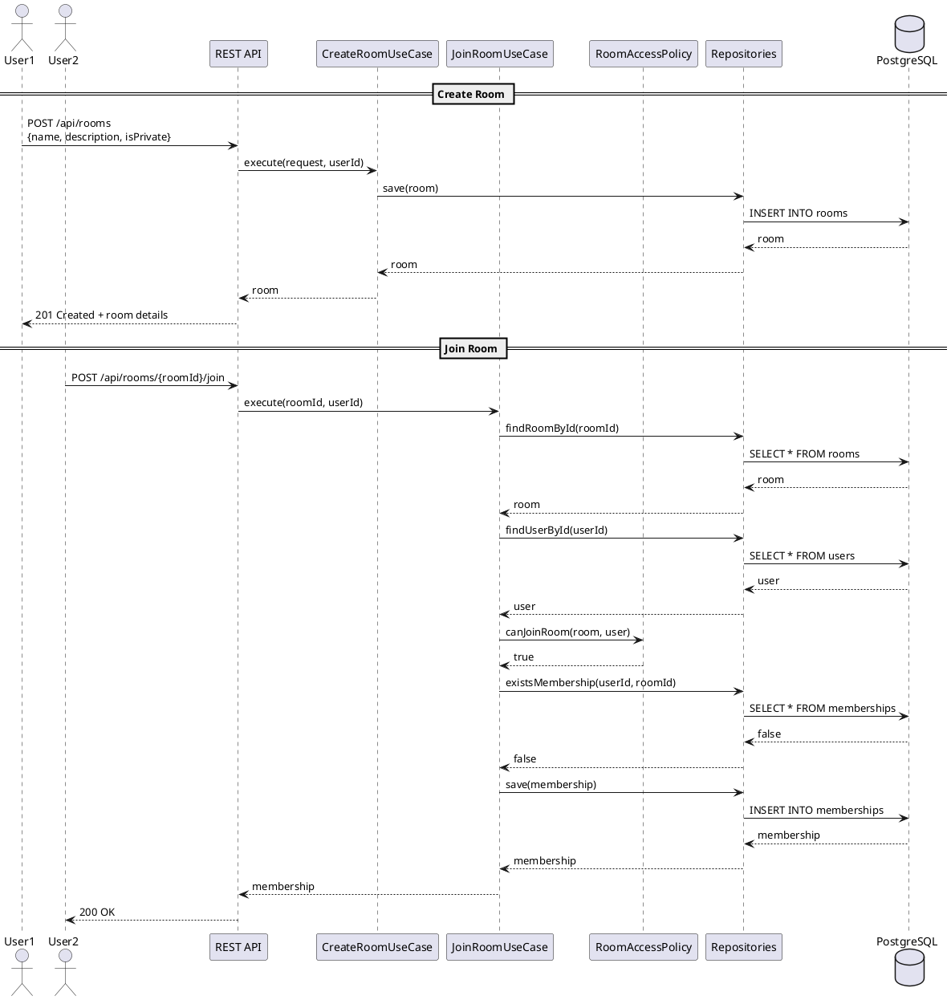
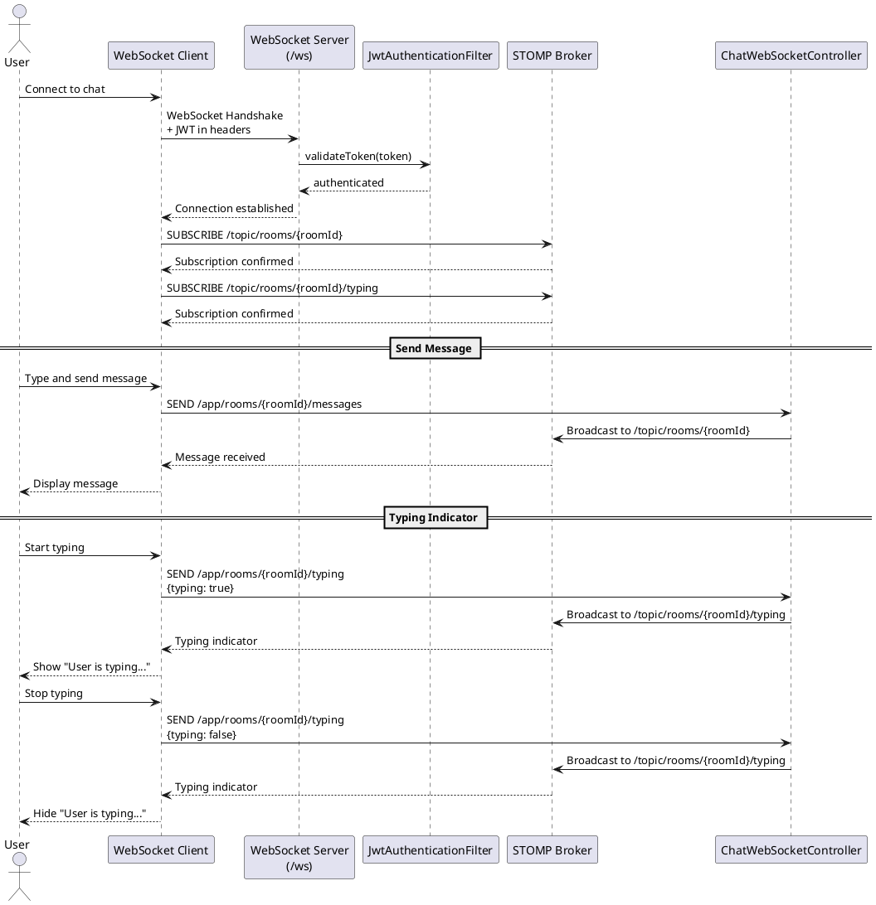
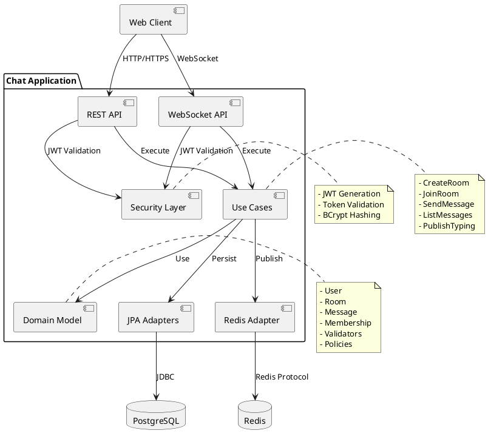
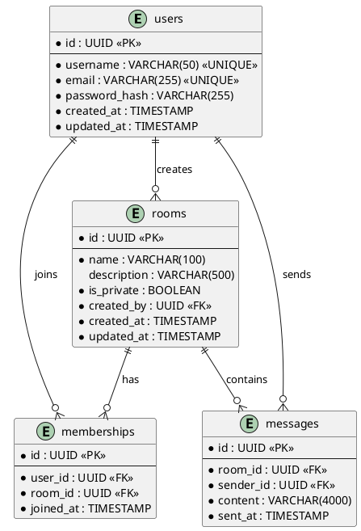
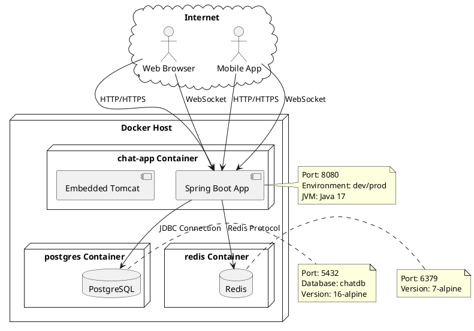
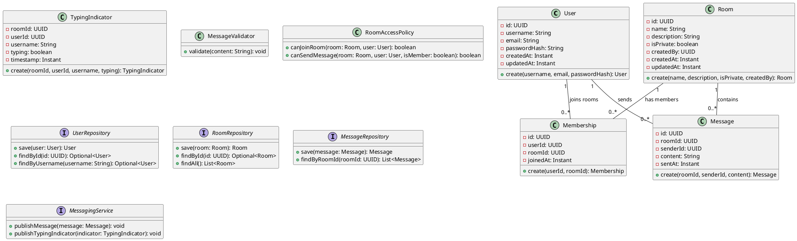

# Architecture Diagrams

This document contains PlantUML text diagrams showing the architecture and key flows of the Chat Application.

## System Architecture

## Authentication Sequence

## Send Message Sequence

## Create and Join Room Sequence

## WebSocket Connection Flow

## Component Diagram

## Database Schema

## Deployment Diagram

## Class Diagram - Domain Layer

## Notes on Diagrams

To render these PlantUML diagrams:

1. Use an online PlantUML editor: http://www.plantuml.com/plantuml
2. Install PlantUML locally with Graphviz
3. Use IDE plugins (IntelliJ IDEA, VS Code)
4. Use command line: `plantuml diagram.puml`

The diagrams illustrate:

- **System Architecture**: Overall layered architecture
- **Authentication Sequence**: Signup and login flows
- **Send Message Sequence**: Real-time message delivery
- **Room Management**: Creating and joining rooms
- **WebSocket Connection**: STOMP protocol flow
- **Component Diagram**: High-level components
- **Database Schema**: Entity relationships
- **Deployment**: Docker container architecture
- **Domain Classes**: Core business entities and interfaces
